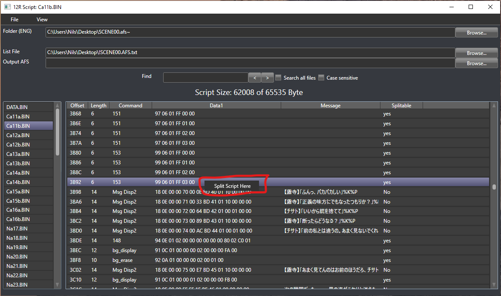
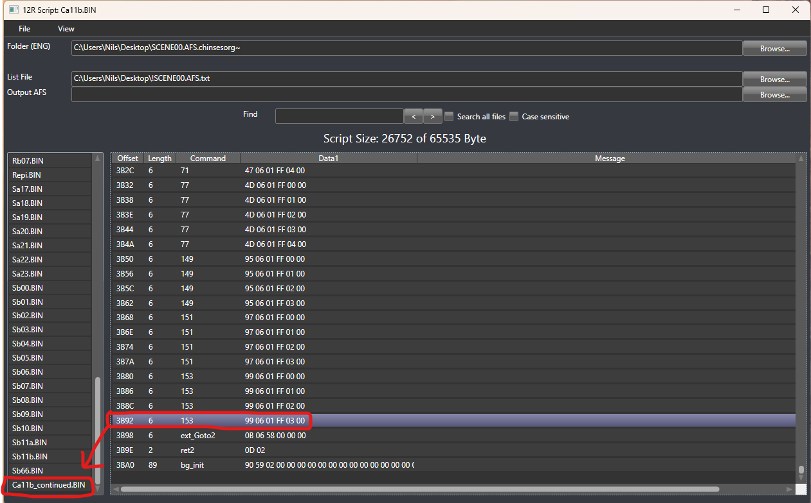
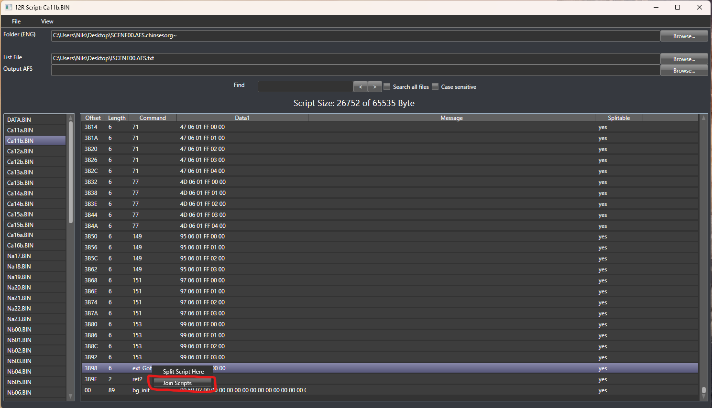

# 12Riven_ScriptEditor

# How to use

## Prerequisite

1. Download [Visual Novel AE Tools](http://wks.arai-kibou.ru/download/ae/ae_20170405_nosrc.7z)

2. Open AE Tools and click on the Archive Tool button

3. Select "Open archive" and select the SCENE00.afs file (/12Riven/FILE)

4. Select the "Extract all files" option and choose a destination for the extraction

5. Right click inside the AE Tool List and select "Generate file order list"

6. After these steps, you should have a folder with serval .BIN files and a text file called !SCENE00.txt.

## Translating a line 

1. Download the 12Riven ScriptEditor

2. For Folder (ENG), choose the folder you extracted with AE Tools

3. For List File, choose the text file you extracted with AE Tools

4. Click on one of the scene files in the list on the left

These files contain all the commands for the scene, like which music or which graphic to show.
For a translation you only need to be concerned about the "Msg Disp2" commands.

5. Click on the line you want to translate

6. Edit the "Message" field. If the message is said by a speaker, you can edit the "Speaker" field as well.
"Command", "Terminate" and "Complete Text" don't need any edit.

7. After editing all the lines you wanted to edit, click "File" and "Save current file" to save you edits.

## Translating a choice option

1. Inside the scene files, click on the "Select Disp2" command

2. A list will open on the left containing all options for the choice

3. Select one of these choices

4. Edit the "Choise" field

5. After finishing all the edits you wanted to make, click "File" and "Save current file"

## Building a new SCENE00.afs file

1. On "Output AFS", click "Browse..."

2. Choose a path where to save the new .afs file and name it "SCENE00.afs"

3. Click "File" and "Export SCENE00.afs"

4. Replace the old SCENE00.afs in your /12Riven/FILE folder with the one you exported

5. Start the game, the game should now display the edits you made

# Splitting Scripts

There might be time where a script with a translation will be bigger than the script file limit of 64Kb. This 
limit is posed by the 12Riven engine and is not a shortcomming of this editor.

The 0.2 version of the 12Riven Script Editor tries to circumvent this limitation by allowing users to split the script
on certain placed, effectivly doubling the size to 128Kb per script. While this is a theoretically number, it should
allow any edits that where to big for one script.

Splitting a script is experimental and it is not possible for now to split a script a scound time or split the script that
contains the continuation of the original script.
Form my testing, it should not break the game, but since the scope is so large, I can not gurarrantie that any split will work.
If the game crashes on a split, please open an issue with where you split the script. Also, use this feature sparingly 
and only if nesccessary.

## Wht is splitting not automatic?

There are about 7000 token in a script and I have only tested a handful of location if a split is possible there.
This means that there are locations where a split wouldn't work. So the user can experiment with different location and
roll the change back if needed. This is the reason why it can not be automated at this time.

## How to split a script

1. Right click a token that is marked as splittable.

2. Click "Split here"

3. The editor will generate a new script and will reference it with a goto token

4. The other part of the script is now in a serparte script called "*_continued.bin"

## Joining script back together

1. Right click the token called "ext_Goto"

2. Click "Join scripts"

3. The script are not back in one piece and a different split location can be choosen

