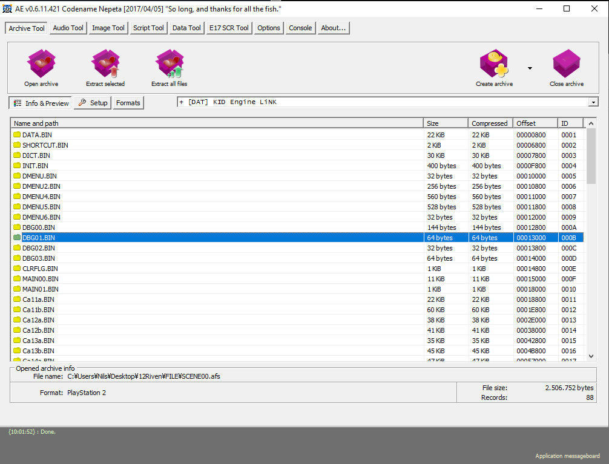
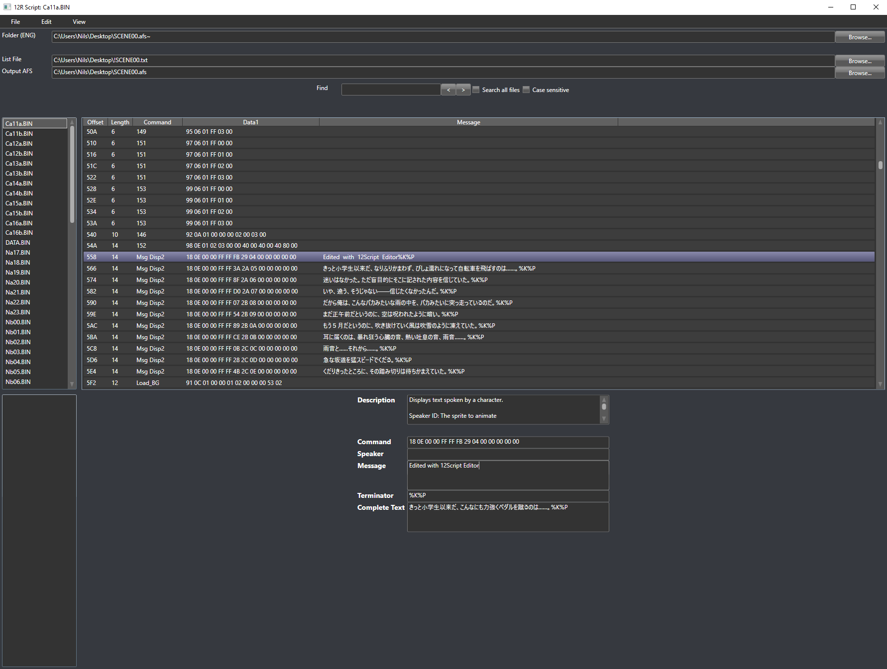
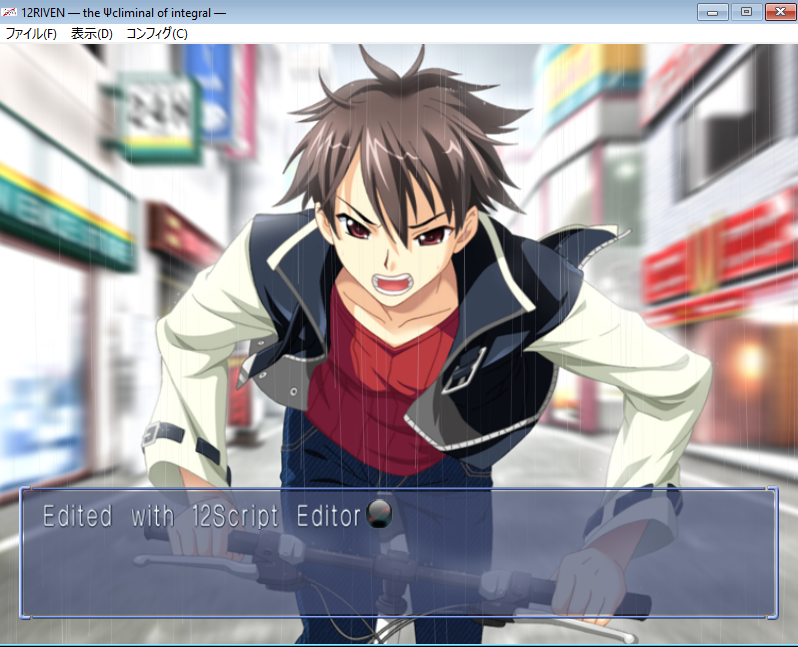

# 12Riven_ScriptEditor

# How to use

## Prerequisite

1. Download [Visual Novel AE Tools](http://wks.arai-kibou.ru/download/ae/ae_20170405_nosrc.7z)

2. Open AE Tools and click on the Archive Tool button

3. Select "Open archive" and select the SCENE00.afs file (/12Riven/FILE)

4. Select the "Extract all files" option and choose a destination for the extraction

5. Right click inside the AE Tool List and select "Generate file order list"

6. After these steps, you should have a folder with serval .BIN files and a text file called !SCENE00.txt.

## Translating a line 

1. Download the [12Riven ScriptEditor](https://github.com/Exormeter/12Riven_ScriptEditor/releases/download/0.0.1/12Riven_ScriptEditor.0.0.1.rar)

2. Open the 12Riven_Script_Editor.exe

3. For Folder (ENG), choose the folder you extracted with AE Tools

4. For List File, choose the text file you extracted with AE Tools

5. Click on one of the scene files in the list on the left

6. Click on the line you want to translate

7. Edit the "Message" field. If the message is said by a speaker, you can edit the "Speaker" field as well.
"Command", "Terminate" and "Complete Text" don't need any edit.

8. After editing all the lines you wanted to edit, click "File" and "Save current file" to save you edits.

These files contain all the commands for the scene, like which music to play or which graphic to show.
For a translation you only need to be concerned about the "Msg Disp2" commands.

## Translating a choice option

1. Inside the scene files, click on the "Select Disp2" command

2. A list will open on the left containing all options for the choice

3. Select one of these choices

4. Edit the "Choise" field

5. After finishing all the edits you wanted to make, click "File" and "Save current file"

## Building a new SCENE00.afs file

1. On "Output AFS", click "Browse..."

2. Choose a path where to save the new .afs file and name it "SCENE00.afs"

3. Click "File" and "Export SCENE00.afs"

4. Replace the old SCENE00.afs in your /12Riven/FILE folder with the one you exported

5. Start the game, the game should now display the edits you made

